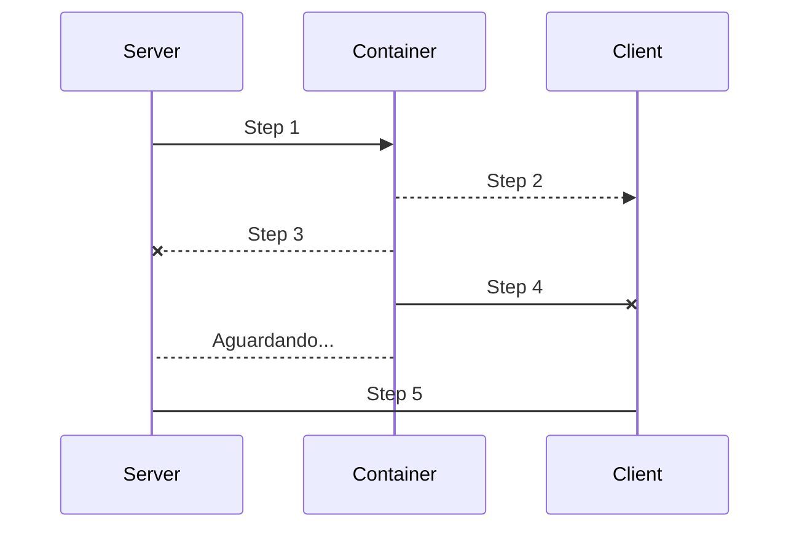
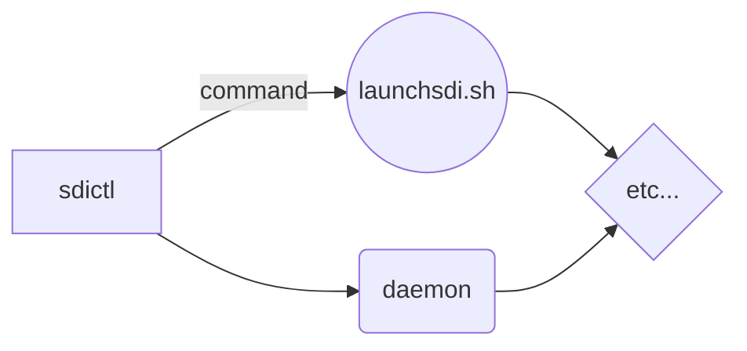

# To do list

**Do you want to help with the project?** Here are some items that would be welcome!

Create an issue to inform about the topic that you are working, if possible comment on how you want to do it.

----------

- **Full documentation** (Urgent)

    Create the full documentation of the project, how to execute, how it works. With charts:
    

----------

- **Link sdictl in /usr/share to use it anywhere dynamically**

----------

- **New sdiweb** 
  
  Responsive and with auth...

----------

- **sdi.conf is a mess, need to organize**

----------

- **Dinamyc server control driver** 

  Possibility of creating and destroying cloud servers through api as needed in Digital Ocean, Google Cloud, Amazon.

----------

- **Add the possibility of informing a container directory to execute**

----------

- **Control the number of containers running through processing percentage**

----------

- **Parallel shipping of containers**

----------

- **Scheduler using queues and not searching in the containers directory**

----------

- **Create more reports, reporting average times, variations, create charts, etc.**

----------

- **Security**

  Exchange keys, increase information security. Are the containers encrypted? Is the storage directory secure? Is encryption necessary? How much does it cost?

----------

- **Refactor the:**
  - sendimage.sh
  - senddockerfile.sh
  - launchsdi.sh (send the core to the clients in the ssh tunnel opened)

----------
